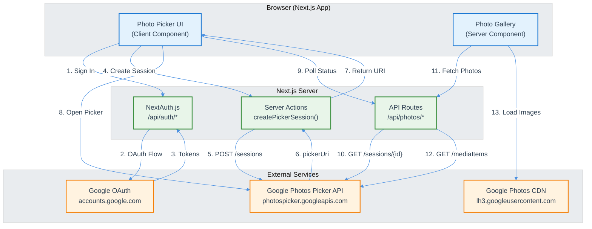

# Next.js + Google Photos Picker API Integration - Technical Design Document

| Document Metadata      | Details                                                    |
| ---------------------- | ---------------------------------------------------------- |
| Author(s)              | Claude                                                     |
| Status                 | Draft (RFC)                                                |
| Team / Owner           | Engineering                                                |
| Created / Last Updated | 2025-12-29                                                 |
| Based on Research      | [research/docs/2025-12-29-nextjs-google-photos-*.md](../docs/) |

## 1. Executive Summary

This RFC proposes implementing a Google Photos integration for a Next.js web application using the new **Google Photos Picker API**. The integration will allow users to securely select photos from their Google Photos library and display them within our application.

**Key Decision**: We must use the **Picker API** (not the legacy Library API) as the `photoslibrary.readonly` scope will be deprecated and return `403 PERMISSION_DENIED` after **March 31, 2025** ([research: API Overview](../docs/2025-12-29-google-photos-picker-api-overview.md#2-difference-from-legacy-library-api)).

**Proposed Solution**: A session-based OAuth flow using NextAuth.js v5 with server-side token management, polling-based photo selection, and a responsive gallery UI with error boundaries.

**Impact**: Users will be able to securely share selected photos from their Google Photos library without granting broad library access, improving both security and user trust.

## 2. Context and Motivation

### 2.1 Current State

The application currently has no integration with Google Photos. Users cannot import or display photos from their Google Photos library.

**External Context**:
- Google is migrating from the Library API to the Picker API
- Legacy scopes (`photoslibrary.readonly`, `photoslibrary.sharing`) will stop working March 31, 2025
- The new Picker API uses a fundamentally different "user-initiated selection" model

### 2.2 The Problem

- **User Impact**: Users must manually download and re-upload photos they want to use in our application
- **Business Impact**: Friction in onboarding reduces engagement; competitors offer seamless photo integrations
- **Technical Constraint**: Google Photos APIs do not support service accounts; OAuth 2.0 user authentication is required

**References**:
- [Google Photos Picker API Overview](../docs/2025-12-29-google-photos-picker-api-overview.md)
- [API Deprecation Timeline](../docs/2025-12-29-google-photos-picker-api-overview.md#2-difference-from-legacy-library-api)

## 3. Goals and Non-Goals

### 3.1 Functional Goals

- [ ] Users can authenticate with Google and grant photo selection permissions
- [ ] Users can select photos from their Google Photos library via Google's native picker UI
- [ ] Selected photos are displayed in a responsive gallery within our application
- [ ] Automatic token refresh maintains user sessions without re-authentication
- [ ] Users can select additional photos in subsequent sessions

### 3.2 Non-Functional Goals

- [ ] OAuth implementation follows OWASP security best practices
- [ ] All tokens stored server-side only; no client-side token exposure
- [ ] Graceful error handling for network failures, token expiration, and rate limits
- [ ] Page load time < 3s for gallery with up to 100 photos

### 3.3 Non-Goals (Out of Scope)

- [ ] We will NOT support the legacy Library API (deprecated)
- [ ] We will NOT allow browsing the user's entire photo library (Picker API doesn't support this)
- [ ] We will NOT store photo content (only references/metadata)
- [ ] We will NOT support video playback in v1 (images only)
- [ ] We will NOT build custom photo management (delete, organize, etc.)

## 4. Proposed Solution (High-Level Design)

### 4.1 System Architecture Diagram



### 4.2 Architectural Pattern

**Session-Based OAuth + Polling Pattern**

The Google Photos Picker API uses a fundamentally different pattern than traditional REST APIs:

1. **Session Creation**: Server creates a picker session, receives a unique `pickerUri`
2. **User Selection**: User opens `pickerUri` in a popup/new tab, selects photos in Google's UI
3. **Polling**: Server polls the session until `mediaItemsSet: true`
4. **Media Retrieval**: Server fetches selected media items using the session ID

This pattern requires:
- Server-side OAuth token management (security)
- Polling mechanism with configurable intervals
- State management for picker flow (idle → picking → polling → complete)

**Reference**: [Architecture Patterns Research](../docs/2025-12-29-nextjs-google-photos-architecture.md#4-integration-patterns)

### 4.3 Key Components

| Component | Responsibility | Technology | Justification |
|-----------|---------------|------------|---------------|
| NextAuth.js | OAuth flow, token refresh | `next-auth@4.24` | Battle-tested, handles edge cases, JWT refresh callbacks |
| API Routes | Proxy to Google APIs | Next.js Route Handlers | Server-side token usage, no client exposure |
| Server Actions | Session creation | Next.js Server Actions | Type-safe, progressive enhancement |
| Photo Gallery | Display photos | React Server Components | SSR, Suspense, streaming |
| Polling Hook | Session status polling | Custom React hook | Configurable interval, timeout handling |

**Reference**: [OAuth Integration Patterns](../docs/2025-12-29-nextjs-oauth-integration-patterns.md)

## 5. Detailed Design

### 5.1 API Interfaces

#### 5.1.1 Create Picker Session

**Endpoint**: `POST /api/photos/sessions`

**Auth**: Requires authenticated session (NextAuth.js)

**Response**:
```json
{
  "sessionId": "abc123",
  "pickerUri": "https://photos.google.com/picker/...",
  "pollInterval": 5000,
  "timeout": 1800000
}
```

#### 5.1.2 Poll Session Status

**Endpoint**: `GET /api/photos/sessions/{sessionId}`

**Response**:
```json
{
  "sessionId": "abc123",
  "mediaItemsSet": true,
  "expireTime": "2025-01-01T00:00:00Z"
}
```

#### 5.1.3 Get Selected Photos

**Endpoint**: `GET /api/photos?sessionId={sessionId}&pageToken={optional}`

**Response**:
```json
{
  "mediaItems": [
    {
      "id": "photo-id-123",
      "baseUrl": "https://lh3.googleusercontent.com/...",
      "mimeType": "image/jpeg",
      "mediaMetadata": {
        "width": "1920",
        "height": "1080",
        "creationTime": "2024-01-01T00:00:00Z"
      }
    }
  ],
  "nextPageToken": "token-for-next-page"
}
```

**Important**: `baseUrl` values expire after 60 minutes. Never cache long-term.

**Reference**: [Picker API Overview](../docs/2025-12-29-google-photos-picker-api-overview.md#4-api-structure-and-implementation-flow)

### 5.2 Data Model / Schema

#### 5.2.1 OAuth Token Storage (NextAuth.js JWT)

Tokens are stored in encrypted JWT cookies (server-side decryption only):

```typescript
interface JWT {
  accessToken: string;        // Google access token (1 hour expiry)
  refreshToken: string;       // Google refresh token (long-lived)
  accessTokenExpires: number; // Unix timestamp
  error?: string;             // "RefreshAccessTokenError" if refresh failed
}
```

#### 5.2.2 Media Item Type

```typescript
interface MediaItem {
  id: string;                 // Unique identifier
  baseUrl: string;            // Image URL (60-min expiry)
  mimeType: string;           // "image/jpeg", "image/png", etc.
  filename?: string;
  mediaMetadata?: {
    width: string;
    height: string;
    creationTime: string;
  };
}
```

#### 5.2.3 Picker Session Type

```typescript
interface PickerSession {
  id: string;
  pickerUri: string;
  pollingConfig: {
    pollInterval: string;  // "5s"
    timeoutIn: string;     // "1800s"
  };
  mediaItemsSet: boolean;
  expireTime: string;
}
```

**Reference**: [TypeScript Types](../docs/2025-12-29-nextjs-google-photos-architecture.md#6-typescript-types)

### 5.3 OAuth Configuration

```typescript
// lib/auth/config.ts
export const authOptions: NextAuthOptions = {
  providers: [
    GoogleProvider({
      clientId: process.env.GOOGLE_CLIENT_ID!,
      clientSecret: process.env.GOOGLE_CLIENT_SECRET!,
      authorization: {
        params: {
          scope: [
            'openid',
            'email',
            'profile',
            'https://www.googleapis.com/auth/photospicker.mediaitems.readonly',
          ].join(' '),
          access_type: 'offline',
          prompt: 'consent',
        },
      },
    }),
  ],
  callbacks: {
    async jwt({ token, account }) {
      // Initial sign-in: store tokens
      if (account) {
        return {
          ...token,
          accessToken: account.access_token,
          refreshToken: account.refresh_token,
          accessTokenExpires: Date.now() + (account.expires_in as number) * 1000,
        };
      }

      // Token still valid
      if (Date.now() < (token.accessTokenExpires as number)) {
        return token;
      }

      // Token expired: refresh
      return refreshAccessToken(token);
    },
    async session({ session, token }) {
      session.accessToken = token.accessToken;
      session.error = token.error;
      return session;
    },
  },
  session: { strategy: 'jwt' },
};
```

**Reference**: [NextAuth.js Configuration](../docs/2025-12-29-nextjs-oauth-integration-patterns.md#14-nextauthjs-configuration-for-google-photos)

### 5.4 File Structure

```
app/
├── api/
│   ├── auth/[...nextauth]/route.ts   # OAuth handler
│   └── photos/
│       ├── route.ts                   # GET: list photos
│       └── sessions/
│           ├── route.ts               # POST: create session
│           └── [sessionId]/route.ts   # GET: poll status
├── photos/
│   ├── page.tsx                       # Main picker page
│   ├── loading.tsx                    # Loading skeleton
│   └── error.tsx                      # Error boundary
├── gallery/
│   └── page.tsx                       # Photo gallery
└── actions/
    └── photos.ts                      # Server Actions

lib/
├── auth/config.ts                     # NextAuth configuration
├── google-photos/
│   ├── client.ts                      # API client
│   └── types.ts                       # TypeScript types
└── utils/
    ├── errors.ts                      # Error handling
    └── retry.ts                       # Retry with backoff

components/
├── GooglePhotoPicker/
│   ├── PickerButton.tsx               # Trigger button
│   ├── PickerStatus.tsx               # Polling indicator
│   └── index.ts
├── PhotoGallery/
│   ├── Gallery.tsx                    # Grid layout
│   ├── PhotoCard.tsx                  # Individual photo
│   ├── Skeleton.tsx                   # Loading state
│   └── index.ts
└── ErrorBoundary.tsx

hooks/
├── useSessionPolling.ts               # Poll picker session
└── usePhotosInfinite.ts               # Paginated photos

types/
├── google-photos.ts                   # API types
└── next-auth.d.ts                     # Type augmentation
```

**Reference**: [File Structure](../docs/2025-12-29-nextjs-google-photos-architecture.md#31-recommended-project-structure)

### 5.5 State Machine: Picker Flow

```
┌───────┐    Create     ┌─────────┐    User Opens    ┌─────────┐
│ IDLE  │──────────────▶│ PICKING │────────────────▶│ POLLING │
└───────┘   Session     └─────────┘     Picker       └────┬────┘
    ▲                                                      │
    │                                                      │
    │       ┌──────────┐    mediaItemsSet               │
    └───────│ COMPLETE │◀──────────────────────────────────┘
            └──────────┘        = true

            ┌─────────┐
    ───────▶│  ERROR  │◀─────── (any failure)
            └─────────┘
```

**States**:
- `IDLE`: Initial state, showing "Select Photos" button
- `PICKING`: Session created, waiting for user to open picker
- `POLLING`: Picker window opened, polling for completion
- `COMPLETE`: Photos selected, displaying gallery
- `ERROR`: Any failure, showing retry option

**Reference**: [Picker Flow Implementation](../docs/2025-12-29-nextjs-google-photos-architecture.md#41-complete-picker-flow)

## 6. Alternatives Considered

| Option | Pros | Cons | Reason for Rejection |
|--------|------|------|---------------------|
| **Legacy Library API** | Full library access, existing documentation | Deprecated March 2025, broad permissions raise privacy concerns | Will stop working; security/privacy issues |
| **Client-side OAuth** | Simpler initial setup | Token exposure, XSS vulnerability, can't refresh | Security risk: tokens accessible to JavaScript |
| **Custom OAuth implementation** | Full control | Reinventing the wheel, edge cases | NextAuth.js handles edge cases we'd miss |
| **Polling from client** | Reduces server load | Requires exposing tokens or session IDs | Security: prefer server-side token handling |

**Selected Approach**: Server-side OAuth with NextAuth.js + server-side polling with Server Actions

**Justification**:
- Tokens never exposed to client (security)
- Battle-tested library handles OAuth edge cases
- Server Actions provide type-safe, progressive enhancement
- Aligns with Next.js best practices

**Reference**: [Security Best Practices](../docs/2025-12-29-google-oauth-security-best-practices.md)

## 7. Cross-Cutting Concerns

### 7.1 Security and Privacy

#### OAuth Security Checklist

| Requirement | Implementation | Reference |
|-------------|----------------|-----------|
| PKCE | NextAuth.js handles automatically | [PKCE Implementation](../docs/2025-12-29-google-oauth-security-best-practices.md#11-pkce-proof-key-for-code-exchange) |
| State Parameter | NextAuth.js handles automatically | [State Parameter](../docs/2025-12-29-google-oauth-security-best-practices.md#12-state-parameter-usage) |
| HTTPS Redirect URIs | Configured in Google Cloud Console | [Redirect URIs](../docs/2025-12-29-google-oauth-security-best-practices.md#13-secure-redirect-uri-handling) |
| HTTP-only Cookies | NextAuth.js default | [Cookie Security](../docs/2025-12-29-google-oauth-security-best-practices.md#33-secure-cookie-configurations) |
| Server-side Tokens | API routes use `getServerSession()` | [Token Handling](../docs/2025-12-29-google-oauth-security-best-practices.md#31-access-token-vs-refresh-token-handling) |
| CSP Headers | Configured in `next.config.js` | [CSP Configuration](../docs/2025-12-29-google-oauth-security-best-practices.md#42-content-security-policy-headers) |

#### Environment Variables

```bash
# .env.local (NEVER commit)

# Public (can be in client bundle)
NEXT_PUBLIC_GOOGLE_CLIENT_ID=your-client-id.apps.googleusercontent.com

# Server-only (NEVER prefix with NEXT_PUBLIC_)
GOOGLE_CLIENT_SECRET=your-client-secret
NEXTAUTH_SECRET=generate-with-openssl-rand-hex-32
NEXTAUTH_URL=http://localhost:3000
```

#### Content Security Policy

```javascript
// next.config.js
const securityHeaders = [
  {
    key: 'Content-Security-Policy',
    value: [
      "default-src 'self'",
      "script-src 'self' https://accounts.google.com https://apis.google.com",
      "style-src 'self' 'unsafe-inline' https://accounts.google.com",
      "img-src 'self' data: https: blob:",
      "connect-src 'self' https://accounts.google.com https://*.googleapis.com",
      "frame-src 'self' https://accounts.google.com",
    ].join('; '),
  },
];
```

**Reference**: [Security Best Practices](../docs/2025-12-29-google-oauth-security-best-practices.md)

### 7.2 Observability Strategy

#### Metrics to Track

| Metric | Type | Alert Threshold |
|--------|------|-----------------|
| `oauth_login_success_total` | Counter | N/A |
| `oauth_login_failure_total` | Counter | > 10% failure rate |
| `picker_session_duration_seconds` | Histogram | p99 > 60s |
| `photos_api_latency_ms` | Histogram | p95 > 2000ms |
| `token_refresh_failure_total` | Counter | Any > 0 |

#### Logging

```typescript
// Structured logging for OAuth events
logger.info('OAuth login succeeded', { userId, provider: 'google' });
logger.error('Token refresh failed', { userId, error: error.message });
logger.info('Picker session completed', { sessionId, photoCount, durationMs });
```

### 7.3 Scalability and Capacity Planning

#### API Quotas

| API | Quota | Mitigation |
|-----|-------|------------|
| Google Photos Picker API | 10,000 requests/day | Aggressive caching, request batching |
| Session creation | Per-user rate limiting | Client-side debouncing |

#### Performance Optimizations

1. **Image Loading**: Use Google Photos URL parameters (`=w400-h400-c`) for thumbnails
2. **Pagination**: Implement infinite scroll with `useSWRInfinite`
3. **Virtualization**: Use `@tanstack/react-virtual` for 100+ photos
4. **Caching**: SWR with `revalidateOnFocus: false` for photo metadata

**Never Cache**: `baseUrl` values (60-minute expiry)

**Reference**: [Performance Optimization](../docs/2025-12-29-nextjs-google-photos-architecture.md#5-performance-optimization)

### 7.4 Error Handling

| Error | User Message | Recovery Action |
|-------|--------------|-----------------|
| 401 Unauthorized | "Please sign in again" | Redirect to login |
| 403 Forbidden | "Permission denied. Please grant photo access" | Show re-auth button |
| 429 Rate Limited | "Too many requests. Please try again in a minute" | Exponential backoff |
| Session Timeout | "Session expired. Please try again" | Reset to IDLE state |
| Network Error | "Connection lost. Retrying..." | Auto-retry with backoff |

**Reference**: [Error Handling](../docs/2025-12-29-google-photos-picker-api-overview.md#7-error-handling)

## 8. Migration, Rollout, and Testing

### 8.1 Deployment Strategy

| Phase | Description | Success Criteria |
|-------|-------------|-----------------|
| Phase 1 | Internal testing | All test cases pass, no security issues |
| Phase 2 | Beta (5% users) | < 1% error rate, positive feedback |
| Phase 3 | GA (100%) | Stable metrics, no critical bugs |

**Feature Flag**: `FEATURE_GOOGLE_PHOTOS_ENABLED`

### 8.2 Pre-Launch Checklist

- [ ] Google Cloud Console project created
- [ ] Google Photos Picker API enabled
- [ ] OAuth consent screen configured
- [ ] OAuth 2.0 Client ID created
- [ ] Redirect URIs configured for all environments
- [ ] OAuth verification submitted (required for production)
- [ ] Environment variables set in deployment platform
- [ ] CSP headers configured
- [ ] Monitoring/alerting set up

### 8.3 Test Plan

#### Unit Tests

```typescript
describe('Token Refresh', () => {
  it('should refresh expired token', async () => { /* ... */ });
  it('should handle refresh failure gracefully', async () => { /* ... */ });
});

describe('Picker Session', () => {
  it('should create session with valid token', async () => { /* ... */ });
  it('should return 401 without token', async () => { /* ... */ });
});
```

#### Integration Tests

```typescript
describe('OAuth Flow', () => {
  it('should complete full OAuth flow', async () => { /* ... */ });
  it('should redirect to login when unauthorized', async () => { /* ... */ });
});

describe('Photo Selection', () => {
  it('should poll until photos selected', async () => { /* ... */ });
  it('should timeout after 30 minutes', async () => { /* ... */ });
});
```

#### E2E Tests (Playwright)

```typescript
test('user can select photos from Google Photos', async ({ page }) => {
  await page.goto('/photos');
  await page.click('text=Sign in with Google');
  // Mock OAuth flow
  await page.click('text=Select Photos');
  await expect(page.locator('.photo-gallery')).toBeVisible();
});
```

## 9. Open Questions / Unresolved Issues

- [ ] **OAuth Verification Timeline**: How long will Google's OAuth verification take? (Can be weeks)
- [ ] **Multi-Tab Handling**: How should we handle users opening picker in multiple tabs?
- [ ] **Session Persistence**: Should we store picker session IDs in database for resume capability?
- [ ] **Quota Scaling**: What's our strategy if we exceed 10,000 requests/day?

## 10. Appendix

### 10.1 Research Documents

| Document | Summary |
|----------|---------|
| [Google Photos Picker API Overview](../docs/2025-12-29-google-photos-picker-api-overview.md) | API structure, endpoints, deprecation timeline |
| [Next.js OAuth Integration Patterns](../docs/2025-12-29-nextjs-oauth-integration-patterns.md) | NextAuth.js config, token refresh, Server Actions |
| [Google OAuth Security Best Practices](../docs/2025-12-29-google-oauth-security-best-practices.md) | PKCE, CSRF, token storage, CSP |
| [Architecture Patterns](../docs/2025-12-29-nextjs-google-photos-architecture.md) | Components, hooks, file structure |

### 10.2 External References

- [Google Photos Picker API Docs](https://developers.google.com/photos/picker/guides/get-started-picker)
- [NextAuth.js Documentation](https://next-auth.js.org/)
- [OWASP OAuth Cheat Sheet](https://cheatsheetseries.owasp.org/cheatsheets/OAuth2_Cheat_Sheet.html)
- [Next.js App Router Authentication](https://nextjs.org/docs/app/building-your-application/authentication)

### 10.3 Glossary

| Term | Definition |
|------|------------|
| **Picker API** | Google's new API for user-initiated photo selection |
| **Library API** | Legacy Google Photos API (deprecated) |
| **pickerUri** | URL that opens Google's photo selection UI |
| **baseUrl** | Temporary URL to access photo content (60-min expiry) |
| **PKCE** | Proof Key for Code Exchange - OAuth security extension |

---

**Document Version**: 1.0
**Last Updated**: 2025-12-29
**Status**: Draft - Ready for Review
